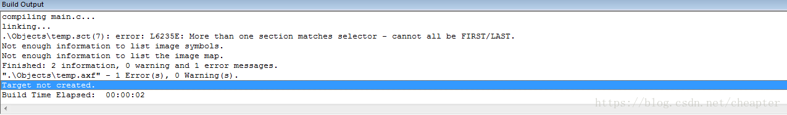

# 新建工程 参考链接：https://blog.csdn.net/cheapter/article/details/80198168
* st官网下载芯片移植library，链接：https://www.st.com/zh/embedded-software/stm32-standard-peripheral-libraries.html
* 新建project文件夹，并在文件夹下建立CMSIS、FWLIB、USER个文件夹
* 将Libraries\CMSIS\CM3\CoreSupport ->（所有文件copy）-> CMSIS
* 将Libraries\CMSIS\CM3\CoreSupport\ST\STM32F10x -> （所有文件copy） -> CMSIS
* 将Library\STM32F10x_StdPeriph_Driver -> (inc src copy) -> FWILB
* 将Project\STM32F10x_StdPeriph_Template -> (非文件夹文件) -> USER
* keil官网下载stm32相对应芯片驱动 链接：https://www.keil.arm.com/packs/  .pack结尾 双击点击安装
* 打开keil -> project -> new uVision Project -> project文件夹下 -> 保存 -> 选择对应芯片 -> ok
* 点击文件管理按钮，修改target1为template，删除SourceGroup1并添加现有的几个文件夹，并添加其中c文件
* 注意：CMSIS里面system_stm32f10x_1.c不添加， 因为在user里重复添加
* 添加STARTUP文件夹，添加CMSIS\startup\arm中的startup_stm32f10x_hd.s、startup_stm32f10x_ld.s、startup_stm32f10x_md.s
* 点击魔法棒，进入c/c++设置，在define中输入STM32F10X_HD,USE_STDPERIPH_DRIVER
* 在incldepath添加引入文件的相对路径
* 编译报错 
* 右键startup_stm32f10x_ld.s 和 startup_stm32f10x_md.s -> Options for File -> include TargetBulid 和 Always Bulid √去掉
* 重新编译即可
